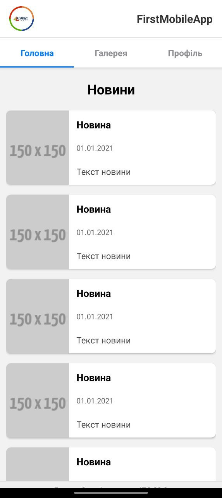
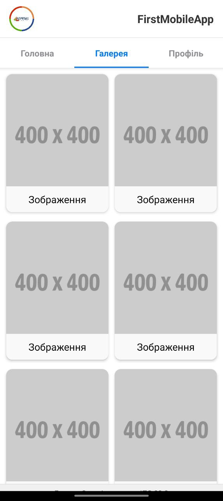
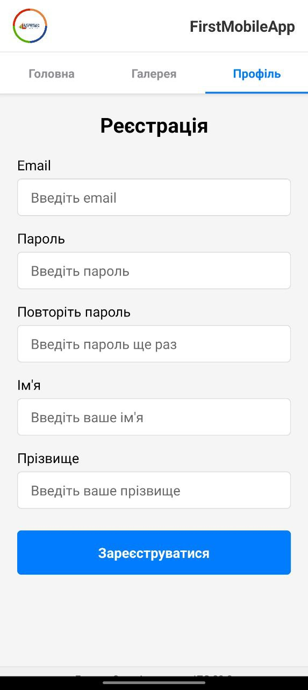

## Requirements

To run this application you'll need:

- [Node.js](https://nodejs.org/) (version 14.x or higher)
- [npm](https://www.npmjs.com/) (comes with Node.js) or [Yarn](https://yarnpkg.com/)
- [Expo CLI](https://docs.expo.dev/get-started/installation/)
- [Expo Go](https://expo.dev/client) app for iOS/Android for testing on physical devices
- Emulators for iOS (macOS only) or Android (available for all OS)

## Installation

1. Clone the repository:

```bash
git clone <your-repository-url>
cd first-mobile-app
```

2. Install dependencies:

```bash
npm install
# or
yarn install
```

3. Install Expo CLI globally (if not already installed):

```bash
npm install -g expo-cli
# or
yarn global add expo-cli
```

## Running the Application

### Development Mode

```bash
npx expo start
# or
yarn expo start
```

### Launch Options


- **On Android emulator**:
  - Launch the Android emulator through Android Studio
  - Press `a` in the terminal or select "Run on Android device/emulator" in the Expo web interface

## Screenshots

### Main Screen


### Gallery Screen


### Profile Screen



